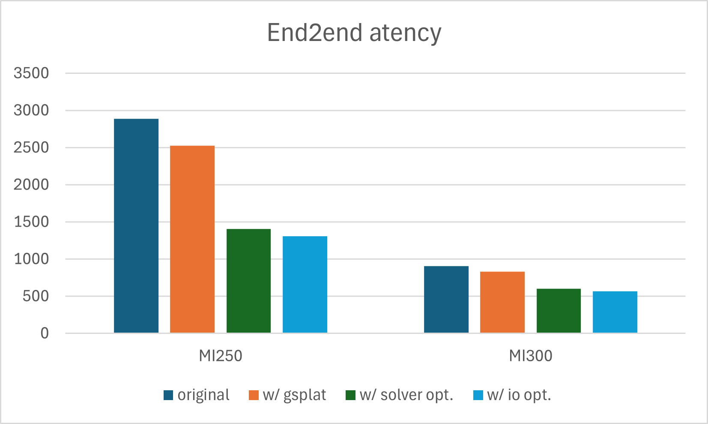

# Efficient and Portable 3D Explorable World Generation on AMD GPUs

<div>
  <a href="https://advanced-micro-devices-rocm-blogs--2313.com.readthedocs.build/projects/internal/en/2313/artificial-intelligence/dworld-m3d/README.html"></a> &ensp;
</div>

---

## 🔆 Introduction

<!-- 3D world generation has become a hot topic. We want to adapt some popular projects to make them competible to ROCm ecosystem. For example, [Matrix-3D](https://github.com/SkyworkAI/Matrix-3D) is a good framework for generating an explorable world by a text or image prompt. More specifically, the framework combines conditional video generation and panoramic 3D reconstruction to generate a world with 3D Gaussian Splatting. Please see their tech report for more details.

In this blog, we describe how we deployed Matrix3D on AMD GPUs (Instinct™ MI250 GPU and Instinct™ MI300 GPU). With several targeted modifications and optimizations, we made the framework both more efficient and more portable. The end-to-end generation time for one world is reduced from 2887s to 1306s on a single MI250 GPU, and from 972s to 482s on a MI300 GPU. -->

3D world generation has emerged as a rapidly growing area of research, and we want to bring popular projects in this space to the ROCm ecosystem. One such project is [Matrix-3D](https://github.com/SkyworkAI/Matrix-3D), a framework that generates an explorable 3D world from a text or image prompt by combining conditional video generation with panoramic 3D reconstruction, and representing the resulting scene as 3D Gaussian Splatting. See their tech report for full details.

In this blog, we describe how we deployed Matrix3D on AMD Instinct™ MI250 and MI300 GPUs. With a series of targeted modifications and optimizations, we made the framework both more efficient and more portable: end-to-end generation time for a single world drops from 2887s to 1306s on one MI250 and from 972s to 482s on one MI300.

## 📝 What This Project Covers
- __[Kernel optimization]__: 🔥Replacing rendering kernels with more portable Triton kernels, with help from the kernel-writing agent [GEAK](https://github.com/AMD-AGI/GEAK), without sacrificing performance.
- __[Faster 3DGS fitting]__: 🔥Replacing the original rasterization backend with gsplat for better efficiency and portability.
- __[Pipeline-level optimization]__: 🔥Refactoring the pipeline to reduce repeated model loading, I/O overhead, and recomputation, while also accelerating depth-map merging.
- __[Reproducible setup]__: 🔥Providing step-by-step instructions for running Matrix3D on AMD GPUs.
- __[End-to-end results]__: 🔥Showing the speedup of the optimized version over the original implementation on AMD GPUs.

## 🎬 Examples

We show both image-to-image and text-to-image results below.

| Prompt | Panoramic Video | 3D Scene |
| :---: | :---: | :---: |
|  |  |  |
| *"an impressionistic winter landscape"* |  |  |

The end-to-end latency is also illustrated in the table and figure below. Overall, the optimized version improves latency by 54% on the MI250 GPU and 50% on the MI300 GPU.

| | Original | w/ gsplat | w/ solver opt. | w/ io opt. | Total Reduction |
|---|:---:|:---:|:---:|:---:|:---:|
| **MI250** | 2887 | 2527 | 1406 | 1306 | 54% |
| **MI300** | 972 | 853 | 507 | 482 | 50% |

End-to-end latency comparison between the original and optimized pipelines on MI250 and MI300.



## Installation
For ROCm GPUs, we suggest using the built-in docker at [rocm/pytorch](https://hub.docker.com/r/rocm/pytorch/tags) for example [rocm/pytorch:rocm7.2_ubuntu22.04_py3.10_pytorch_release_2.9.1](https://hub.docker.com/layers/rocm/pytorch/rocm7.0.2_ubuntu22.04_py3.10_pytorch_release_2.9.1/images/sha256-e252838108c3d0e22e05a853d6b46300f3177add60c4c6a927673816bab1a6f2). 

After running the docker, clone our project and run:
```
bash scripts/install_m3d.sh
```
All the dependencies will be installed automatically. 

## Usage
For text prompts, run:
```
bash scripts/run_m3d_i2i.sh
```

For image prompts, run:
```
bash scripts/run_m3d_t2i.sh
```

## Acknowledgements
We are grateful for the excellent work of:
- [Matrix-3D](https://github.com/SkyworkAI/Matrix-3D)
- [GEAK](https://github.com/AMD-AGI/GEAK)
- [gsplat_rocm](https://github.com/ROCm/gsplat)
- [OSEDiff](https://github.com/cswry/OSEDiff)
